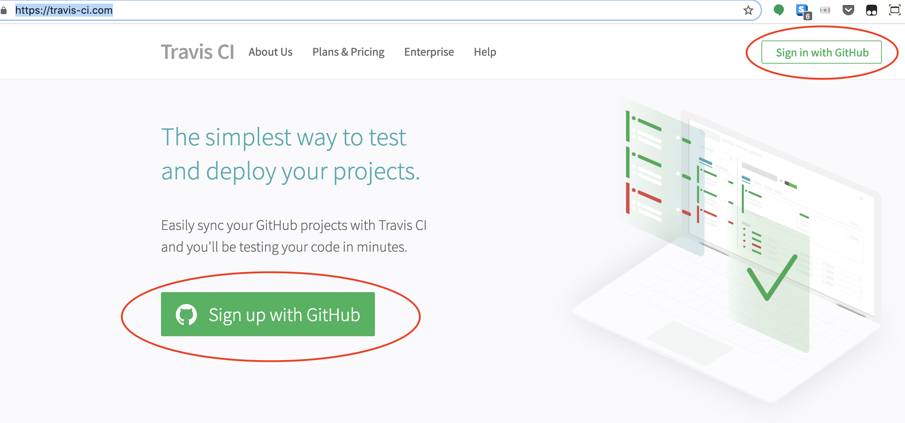
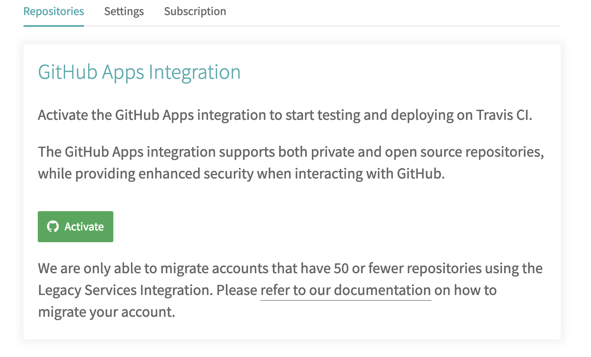
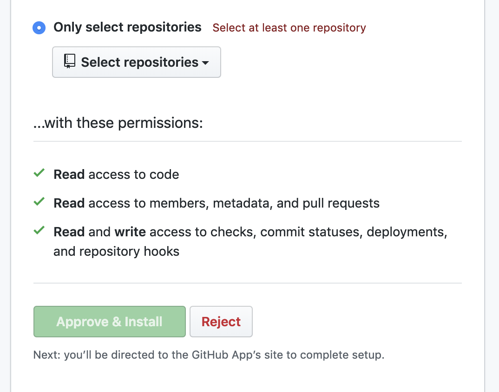

# Travis CI Setup

## Prerequisites

Make sure you have **owner permissions** for the repo on GitHub that you want to connect to Travis CI.

If you made the repo, then no further action is needed, but if not, make sure to obtain those permissions.

## Phase 1: Account Setup

1. Go to [Travis CI](https://travis-ci.com/) and click the **Sign Up with GitHub** button:


1. Accept the authorization that Travis CI needs for GitHub
1. Press the **Activate** button

1. Choose which repo you want Travis CI to integrate with, then press **Approve & Install**


## Phase 2: Travis.yml Setup

1. In your repo, create a `travis.yml` file. This will tell Travis CI what to do when you push to your repo
1. Make sure your repo includes the following:
	- `language`: should specify what language you're using
	- `install`: a command used to install dependencies
	- `script`: a comman to run your tests

Here is an example `travis.yml` file:

```yaml
	language: python
	script:
		- pytest
```

**Note the "-" used for `script`!** You need that as well for `install`

## Phase 3: ~~Profit~~ Commit and Push!

Now commit and push to your repo. Log in to your Travis CI account to see your build status, as well as what tests pass/fail!

## Resources

- [Travis CI Documentation](https://docs.travis-ci.com/)
- [Language specific Travis CI docs](https://docs.travis-ci.com/user/languages/)
